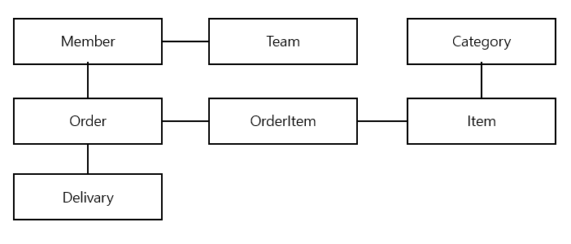

<h1><b>JPA 소개 🦰</b></h1>

 
<h2>1. JPA 소개</h2>
 기존에 데이터 접근 계층을 개발 하는 과정은 SQL을 수정 해야 하고, JDBC API를 계속 바꿔줘야 하는 단점이 있었다.  
<h4>1-1. SQL을 직접 다룰 때 발생하는 문제점</h4>

    <ol>
        <li>DAO 계층을 숨기더라도 직접 SQL을 열어서 확인을 해야했다(계층 분할의 문제)</li>
        <li>필드가 추가될 경우 연관되어 있던 쿼리들에 대해서 전부 필드를 추가 및 맵핑해줘야 했다.(SQL에 의존적인 개발)</li>
        <li>요구사항을 모델링한 객체를 엔티티라 하는데 SQL에 의존적이기 때문에 해당 객체를 신뢰할 수 없다(엔티티를 신뢰할 수 없음)</li>
    </ol> 
    이 문제를 해결하기위해 JPA는 어떤방식으로 문제 해결 JPA의 CRUD API를 살펴보자. 
     
    <h3>1. 저장기능</h3>
    <code>
        jpa.persist(member);    //저장
    </code>
    <blockquote>
        persist() 메소드는 JPA가 객체와 매핑정보를 보고 INSERT SQL을 생성하여 데이터베이스에 저장한다.
    </blockquote>
    <h3>2. 조회 기능</h3>
    <code>
        String memeberId = "helloId"; 
        Member member  = jpa.find(Member.class, memberId);  //조회
    </code>
    <blockquote>
        find() 메소드는 JPA가 객체와 매핑정보를 보고 적절한 SELECT SQL을 생성해서 결과로 인자로 넣은 객체를 생성해서 반환한다.
    </blockquote>
    <h3>3. 수정 기능</h3>
    <code>
        Member member  = jpa.find(Member.class, memberId); 
        member.setName("변경할이름"); //수정
    </code>
    <blockquote>
        수정은 별도의 메소드를 제공하지 않고 트랜잭션을 커밋할 때 객체를 조회해서 적절한 UPDATE SQL을 실행시킨다.
    </blockquote>
    <h3>4. 연관된 객체 조회</h3>
    <code>
        Member member  = jpa.find(Member.class, memberId); 
        Team team = member.getTeam();   //연관된 객체 조회
    </code>
    <blockquote>
        JPA는 연관된 객체를 사용하는 시점에 SELECT SQL을 실행해준다.
    </blockquote>

<h4>1-2. 패러다임의 불일치</h4>

    <h5>데이터를 저장하기 위해 데이터베이스를 사용하지만 데이터베이스는 추상화, 상속, 다형성 같은 개념이 없다. 
    객체와 데이터베이스는 서로 목적이 다르므로 패러다임 불일치 문제가 있는데 이 문제점들을 알아보고 JPA를 통한 해결책을 알아보자 
     
    1. 상속  
    자바 객체에서는 아래 코드와 같이 쉽게 상속을 구현할 수 있지만 데이터베이스에서는 상속이라는 개념이 없다  
    데이터베이스 모델링에서는 슈퍼타입 서브타입 관계를 사용하면 유사하게 구현할 수는 있지만 그에 따라 컬럼을 관리하여 주여야하고 
    조회를 할 때에도 테이블을 조인한 후 해당 결과로 객체를 생상해야 하는데 코드량도 늘어나서 관리가 쉽지않다
    <pre><code>
    abstract class Item {
        Long id;
        int price;
    } 
    class Album extends Item {
        String artist;
    } 
    class Movie extends Item {
        String director;
        String actor;
    } 
    class Book extends Item {
        String author;
        String isbn;
    } 
    </code></pre>하지만 자바 컬렉션에 보관한다면 매 쉽게 해결 가능하다.
    <pre><code> 
    list.add(album);
    list.add(movie);
     
    Album album = list.get(albumId);</code></pre>
    </h5>
    JPA를 사용하면 위처럼 컬렉션을 저장하듯 작성할 수 있으며 패러다임의 문제 또한 해결할 수 있다. 
     <code>jpa.persist(album);</code> 
     persist 메소드를 사용해서 객체를 저장하면 JPA는 ITEM과 ALBUM 두 테이블에 나누어서 INSERT문을 실행한다. 
     다음으로 Album 객체를 조회해보자
    <pre><code>String albumId = "id100";
Album album = jpa.find(Album.class, albumId);</code></pre>
그러면 ITEM과 ALBUM 두 테이블을 조인해서 데이터를 조회하고 데이터를 반환해준다.
  
2. 연관관계 
객체는 참조를 통해서 관계를 맺는데 자바에서의 참조는 해당 객체를 그대로 참조할 수 있지만 테이블은 외래 키를 사용해서 조인을 통해 연관되어있는 테이블을 조회하여야 한다. 
 우선 테이블에 맞춘 객체 모델을 보도록 하자.
<pre><code>
class Member {
    String id;  //MEMBER_ID 컬럼 사용
    Long teamId;    //TEAM_ID PK 컬럼 사용
    String username;    //USERNAME 컬럼 사용
}
 
class Team {
    Long id;    //TEAM_ID PK 사용
    String name;    //NAME 컬럼 사용
}
</code></pre>
위의 설명과 같이 데이터베이스를 사용한다면 Member 클래스의 teamId를 이용해서 테이블에서 조인하여 얻을 수 있겠지만, 
객체에서는 연관된 참조를 보관해야 연관된 객체를 찾을 수 있을것이다. => <code>Team team = member.getTeam();</code> 
 해당 모델링으로는 객체지향의 특징을 잃어버리게 된다. 
다음으로는 객체지향에 맞춘 모델을 보도록 하자.
<pre><code>
class Member {
    String id;  //MEMBER_ID 컬럼 사용
    Team team;    //참조로 연관관계를 맺는다
    String username;    //USERNAME 컬럼 사용
     
    Team getTeam() {
        return team;
    }
}
 
class Team {
    Long id;    //TEAM_ID PK 사용
    String name;    //NAME 컬럼 사용
}
</code></pre>
이제 <code>Team team = member.getTeam();</code> 코드를 통해서 연관된 팀을 쉽게 가져올 수 있게보인다,  
하지만 데이터베이스에 저장할 때 team 필드를 TEAM_ID 외래키 값으로 변환하고 INSERT 시켜주어야하고, 조회할때에도 Member객체를 만들때 연관관계를 설정하는 과정에서 추가적인 비용이 발생한다. 
 
JPA는 연관관계에 관한 패러다임 불일치 문제를 해결해줄 수 있다
<pre><code>
/*저장*/
member.setTeam(team) //회원과 팀 연관관계 설정
jpa.persist(member) //회원과 연관관계 함께저장 
/*조회*/
Member meber = jpa.find(Member.class, memberId);
Team team = member.getTeam();
</code></pre>
jpa는 외래키로 변환해서 INSERT하는 일과 조회할 때 외래키를 참조를 변환하는 일도 모두 처리해준다. 
 
3. 객체 그래프 탐색

객체관계가 위처럼 설계되어있다고 가정해보자.
다음은 객체를 탐색하는 코드다. 
<code>member.getOrder.getOrderItem();</code> 
아래와 같은 SQL을 사용한다고 쳐보자
<pre><code>SELECT M.*, T.*
FROM MEMBER M
JOIN TEAM T ON M.TEAM_ID = T.TEAM_ID</code></pre>
위와같은 코드로 member객체를 얻는다 해도 order객체를 찾으려고하면 null을 리턴할것이다. 
SQL에 의존적인 개발이 되고 따라서 상황에 따른 메소드가 늘어나면서 복잡도가 늘어나게 된다.  
JPA는 객체그래프를 탐색할때 지연로딩(Lazy Loading)을 사용한다. 
아래는 JPA의 지연로딩을 사용한 Order객체를 지연로딩하는 코드이다. 
<pre><code>//처음 조회 시점에 SELECT MEMBER SQL 
Member member = jpa.find(Member.class, memberId); 
Order order = member.getOrder();
order.getOrderDate();   //Order을 사용하는 시점에 SELECT ORDER SQL</code></pre>
위처럼 지연로딩으로 필요할 때에 조회하는 방법이 있고, 
JPA는 연관된객체를 즉시 조회할지 실제 사용될되는 지점에 지연해서 조회할지 간단한 설정으로 정의할 수도있다.  
4. 비교 
동일성(identity)은 객체의 인스턴스 주소값을 비교하고 동등성(equality)는 객체 내부의 값을 비교하는데 JPA를 사용하지 않는다면 동일성을 보장하지 않는다 
<pre><code>class MemberDAO {
    public Member getMember(String memberId) {
        String sql = "SELECT * FROM MEMbER WHERE MEMBER_ID = ?";
        ...
        //JDBC API, SQL 실행
        return new Member(...);
    }
}
</code></pre>다음과 같은 DAO에서 조회를 한 후 비교를 하는 코드를 살펴보자. 
<pre><code>String memberId = "100";
Member member1 = memberDAO.getMember(memberId);
Member member2 = memberDAO.getMember(memberId);
member1 == member2; //false</code></pre>
실제로 데이터는 같지만 새로운 인스턴스에 할당했기 때문에 동일성이 보장되지 않는다. 
만약 객체를 컬렉션에 보관했다면 동일성 비교에 성공했을 것이다.
<pre><code>Member member1 = list.get(0);
Member member2 = list.get(1);
member1 == member2; //true</code></pre>
이런 패러다임의 불일치의 문제도 JPA가 해결해 줄 수 있다. 
JPA는 같은 트랜잭션에 있을 때 객체 조회 시 동일성을 보장해 준다. 
<pre><code>String memberId = "100";
Member member1 = jpa.find(Member.class, memberId);
Member member2 = jpa.find(Member.class, memberId);
 
member1 == member2; //true</code></pre>
 
5. 정리 
객체모델과 관계형데이터 모델의 지향하는 패러다임이 다르다. 
어플리케이션이 복잡해 질수록 데이터 중심의 모델로 변해가는데 이에 따른 비용이 커진다. 
JPA는 이러한 문제들을 해결해 줄 수 있을것이다.
<h4>1-3. JPA란 무엇일까?</h4>

<h4>1-4. 정리</h4>

<h4>1-5. ORM에 대한 궁금증과 오해</h4>
