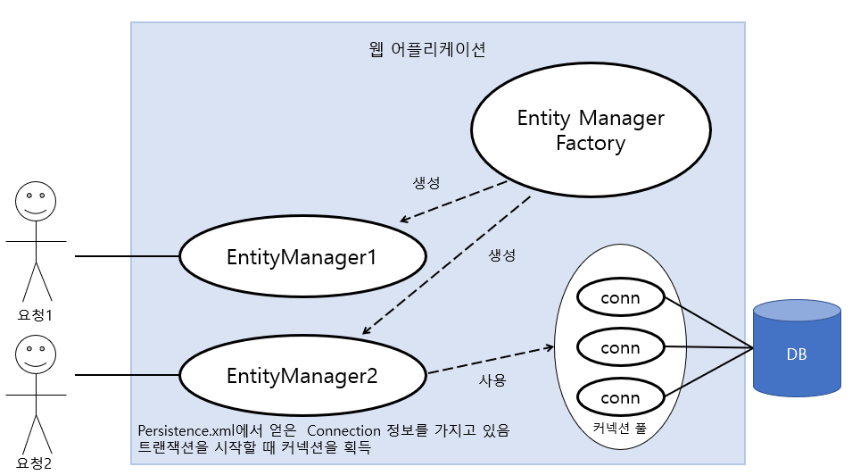
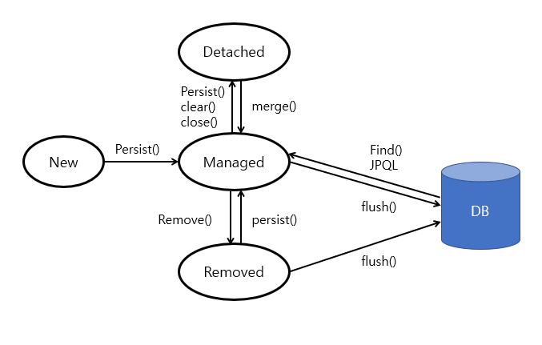
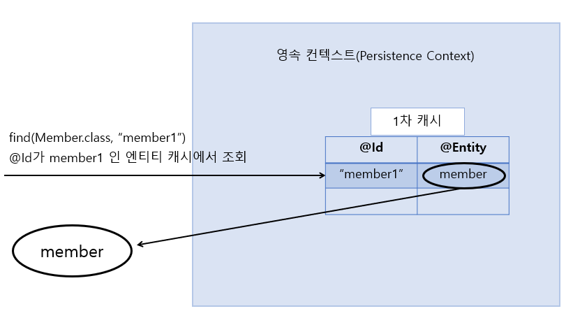
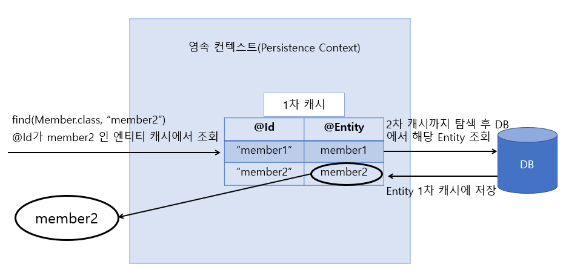
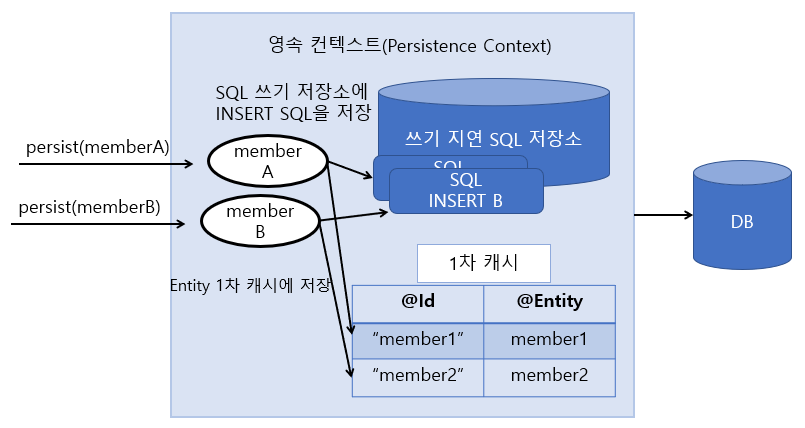
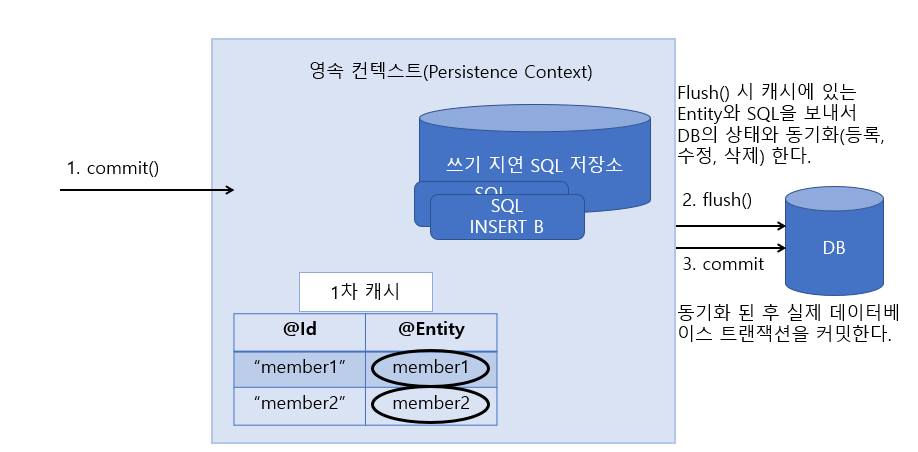

<h1><b>영속성 관리 🧺</b></h1>

 
<a href="https://github.com/EungyuCho/orm_group_study/blob/master/README.md">목차로 돌아가기</a> 🏃 
<h3>3장은 매핑한 엔티티를 어떻게 사용하는지 알아보자</h3>
<h1>엔티티 매니저 팩토리와 엔티티 매니저</h1>

EntityManagerFactory는 어플리케이션에서 데이터베이스당 하나만 생성한다. 
앞장에서도 설명했지만 <code>EntityManagerFactory emf = Persistence.createEntityManagerFactory("jpabook");</code> 
코드를 통해 팩토리를 생성한다. 
<code>EntityManager em = emf.createEntityManager();</code> 
그리고 필요할 때마다 팩토리에서 엔티티매니저를 생성하여 사용한다. 
팩토리는 여러 스레드가 동시에 접근해도 안전하므로 공유해도 되지만 엔티티 매니저는 동시성 문제가있으므로 스레드간에 분리가 필요하다.  
다음은 일반적인 웹 어플리케이션의 엔티티 매니저 흐름이다.

그림에 나와있듯이 EntityMnager는 데이터베이스에 연결이 필요한 시점까지 Connection을 생성하지 않고 트랜잭션을 시작할 때 커넥션을 획득한다. 

<h1>영속성 컨텍스트란?</h1>

영속성 컨텍스트란 '엔티티를 영구 저장하는 환경' 이라는 뜻이다. 
<code>em.persist(member);</code>  
지금까지는 이 코드를 회원 엔티티를 저장한다고 표현했지만 정확히는 엔티티 매니저를 사용해서 회원 엔티티를 영속성 컨텍스트에 저장한다. 
<blockquote>
    여러 엔티티 매니저가 같은 영속성 컨텍스트에 접근할 수도 있다.
</blockquote>

<h1>엔티티의 생명주기</h1>

<ol>
    <li>비영속(new/translent) : 영속성 컨텍스트와 전혀 관계가 없는 상태</li>
    <li>영속(managed) : 영속성 컨텍스트에 저장된 상태</li>
    <li>준영속(detached) : 영속성 컨텍스트에 저장되었다가 분리된 상태</li>
    <li>삭제(removed) : 삭제된 상태</li>
</ol>
아래는 생명 주기를 나타낸 그림이다. 

 
<h3>1.비영속</h3>
<pre><code>객체를 생성한 상태(비영속)
Member member = new Member();
member.setId("member1");
member.setUsername("회원1");</code></pre>
엔티티 객체를 생성하고 저장하지 않은 상태로 Persistence Context나 Database에 관련이 없는 상태이다. 
 
<h3>2.영속</h3>
<pre><code>//객체를 저장한 상태  em.persist(member);</code></pre>
엔티티 매니저를 통해서 Persistence Context에 저장한 상태이고 영속성 컨텍스트가 관리하는 엔티티를 영속 상태라 한다.
<blockquote>Persistence Context는 Application과 DB 중간계층에서 버퍼링과 캐싱등의 기능을 제공한다. 
Persistence Context의 1차 캐시 기능은 위처럼 persist나 find시 해당 데이터를 Map형태로 저장한다. 
find 시 Context 캐시에 해당 엔티티가 있다면 바로 캐시에서 리턴을 해주고 없다면 DB에서 찾아서 가져오고, 캐시에 저장을 한 후 리턴해준다. 
Presistence Context에 있는 엔티티는 flush 호출 시 데이터베이스에 반영된다. 
1차 캐시는 트랜잭션이 끝나면 사라진다.(1차 캐시뒤에 2차캐시가 있는데 2차캐시는 어플리케이션 중지까지 사라지지않음 -> @Cacheable)
</blockquote>
<h3>3.준영속</h3>
<pre><code>//회원 엔티티를 영속성 컨텍스트에서 분리, 준영속 상태 em.detach(member);</code></pre>
Presistence Context가 관리하던 엔티티를 관리하지않는 상태로 Context가 지원하는 어떤 기능도 동작하지않는다. 
1차캐시에서 제거되며 SQL 저장소에 있었던 SQL도 모두 제거되어 commit하더라도 반영되지않는다.
detatch(), close(), clear() 메소드를 통해서 준영속 상태를 만들 수 있다. 
<h3>4.삭제</h3>
<pre><code>//객체를 삭제한 상태(삭제) em.remove(member);</code></pre>
영속성컨텍스트와 데이터베이스에서 엔티티를 삭제한다.

<h1>영속성 컨텍스트의 특징</h1>

<h4>영속성 컨텍스트의 특징</h4>
<ol>
    <li>영속 상태가 되려면 식별자 값이 반드시 있어야한다. 없으면 예외가 발생한다.
    <blockquote>
        @throws IllegalArgumentException if instance is not an entity or is a removed entity
    </blockquote></li>
    <li>플러시(flush)를 통해 영속성 컨텍스트가 엔티티를 데이터베이스에 반영한다.</li>
    <li>Persistence Context의 장점
        <ol>
            <li>
                1차 캐시 : 엔티티를 Map 형태로 저장하는 Entity 저장 공간이다.
            </li>
            <li>
                동일성 보장 : 캐시의 효과로 @Id로 되어있는 식별자를 get하여 엔티티 인스턴스를 반환하므로 반복하여 호출하여도 같은 엔티티를 가진다. 
            </li>
            <li>
                트랜잭션을 지원하는 쓰기 지연 : 트랜잭션의 commit 전까지 Context에 SQL을 쌓아뒀다가 한번에 데이터베이스에 반영한다.
            </li>
            <li>
                변경 감지 : 1차 캐시에 있던 엔티티의 최초상태와 다를 경우 commit 시 Update 시켜준다
            </li>
            <li>
                지연 로딩 : Lazy Loaing 설정이 되어있는 엔티티를 프록시 객체로 가져오고 실제 객체를 사용하는 시점(get~())에 DB에서 호출한다.
            </li>
        </ol>
    </li>
</ol>
<h3>엔티티 조회</h3>
Persistence Context는 내부에 있는 1차 캐시에 Map<@Id(엔티티 식별자), Object(엔티티)> 형태로 엔티티가 저장된다. 
<pre><code>//엔티티를 생성한 상태(비영속)
Member member = new Member();
member.setId("member1");
member.setUsername("회원1");
 
//엔티티를 영속(persist 하는 시점에 1차 캐시에 저장)
em.persist(member);
 
//1차 캐시에서 조회
Member findMember = em.find(Member.class, "member1");</code></pre>
@Id가 member1인 Member 객체를 엔티티로 영속시켰으므로 find 시 1차 캐시에 있던 엔티티를 리턴해준다. 

위의 그림과 같이 Entity를 persist 하면 1차 캐시에 저장한다. 그리고 다음번에 find한 @Id의 Entity가 있을 경우 해당 Entity를 리턴해준다.

하지만 조회했을 때 Context에 없을경우 db에서 해당 Entity를 조회한 후 1차 캐시에 저장한 뒤 리턴해준다. 
1차 캐시에서 엔티티를 관리해주기 때문에 Persistence Context는 성능과 동일성을 보장한다. 
<h3>엔티티 등록</h3>
<pre><code>EntityManager em = emf.createEntityManager();
EntityTransaction transaction = em.getTransaction();
//엔티티 매니저는 데이터 변경 시 트랜잭션을 시작해야 한다.
transaction.begin();    //트랜잭션 시작
 
em.persist(memberA);
em.persist(memberB);
//1차 캐시 Map에 해당 엔티티를 저장하고, SQL 쓰기지연 저장소에 해당 Insert SQL을 보관한다.
 
//커밋하는 순간 데이터베이스에 쓰기지연 저장소에 있던 SQL을 한번에 보낸다.
transaction.commit();   //트랜잭션 커밋</code></pre>
우선 1차 캐시 저장까지의 과정을 보자 

위처럼 persist 시 데이터를 캐시에 저장하고 쓰기지연 SQL저장소에 SQL문을 전부 저장한다.

flush 시 처음 스냅샷이 차이(처음 엔티티가 들어왔을때의 상태와 현재 상태를 비교)가 있는지 비교해서 변경이 있을 시 UPDATE SQL문을 생성하고, 데이터베이스에 지연 SQL 저장소에 있던 SQL문들을 반영한다. 
<h3>엔티티 수정</h3>
<pre><code>EntityManager em = emf.createEntityManager();
EntityTransaction transaction = em.getTransaction();
transaction.begin();    //트랜잭션 시작
 
//영속 엔티티 조회
Member memberA = em.find(Member.class, "memberA");
 
//영속 엔티티 데이터 수정
memberA.setUsername("hi");
memberA.setAge(10);
 
//em.update(member) -> 이러한 코드가 있어야하는건 아닐까? 
transaction.commit();</code></pre>
위의 코드처럼 find를 하고나서 해당 엔티티를 수정하려면 업데이트를 따로 해줘야하는게 아닐까 생각할 수 있지만, 
엔티티의 변경을 데이터베이스에 반영하는 기능을 가진 변경감지(dirty checking)이라는 기능 덕분에 이를 피할 수 있다. 
 
JPA는 엔티티를 Presistence Context에 보관할때 최초의상태를 복사해서 스냅샷을 저장해둔다. 그리고 flush 시점에 스냅샷과 flush 전 엔티티의 상태를 확인해서 변경된 엔티티를 확인해서 수정쿼리를 SQL저장소에 보낸다.
<blockquote>
처리 순서는 다음과 같다. 
<ol>
    <li>트랜잭션을 커밋하면 엔티티 매니저 내부에서 먼저 flush가 호출된다.</li>
    <li>엔티티와 스냅샷을 비교해서 변경된 엔티티를 찾는다</li>
    <li>변경된 엔티티가 있으면 수정 쿼리를 생성해서 쓰기 지연 SQL저장소에 보낸다.</li>
    <li>쓰기 지연 저장소의 SQL을 데이터베이스에 보낸다.</li>
    <li>트랜잭션을 커밋한다.</li>
</ol>
❗ 변경 감지기능은 영속성 컨텍스트가 관리하는 영속상태인 엔티티에만 적용된다.
</blockquote>
JPA는 업데이트 쿼리를 생성할 때 기본전략으로 모든 업데이트 컬럼을 업데이트하는데, hibernate의 DynamicUpdate를 사용 시 수정된 데이터만 동적으로 Update할 수 있다.
<h3>엔티티 삭제</h3>
<pre><code>Member memberA = em.find(Member.class, "memberA");   //삭제 대상 엔티티 조회
em.remove(memberA); //엔티티 삭제</code></pre>
em.remove()에 엔티티를 넘겨주면 삭제 SQL을 쓰기 지원 SQL 저장소에 등록하고 트랜잭션을 커밋해서 플러시를 호출 시 데이터베이스에 삭제를 반영한다. 
remove를 하는 순간 Persistence Context에서 삭제되므로 재사용 안하는게 좋다.

