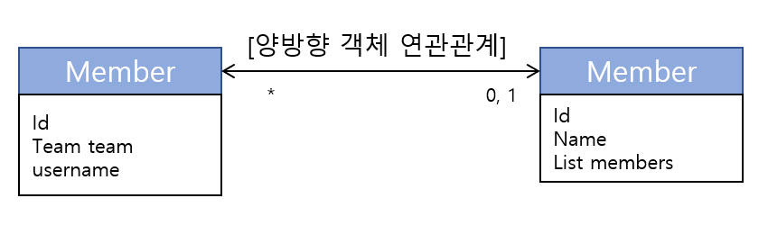

<h1><b>연관관계 기초 ♻</b></h1>

 
<a href="https://github.com/EungyuCho/orm_group_study/blob/master/README.md">목차로 돌아가기</a> 🏃 
<h3>5장에서는 JPA의 참조와 외래키를 어떻게 매핑하는지 알아보자.</h3>
엔티티는 대부분 다른 엔티티가 연관관계가 있다. 
객체는 참조(주소)를 사용해서 관계를 맺고 테이블을 외래 키를 사용해서 관계를 맺는다. 
서로 다른 두개를 매핑하는것이 이장의 목표이다. 
시작하기 전에 연관관계 매핑을 이해하기 위해 두가지 키워드를 정리해보자.
<ol>
    <li>방향(Direction): [단방향, 양방향]이 있다. 방향은 객체관계에만 존재하고 테이블 관계는 항상 양방향이다<blockquote>
    예를 들어 회원과 팀이 있을때 회원 -> 팀 또는 팀 -> 회원 둘 중 한쪽만 참조하는 것을 단반향 관계라 하고 회원 -> 팀, 팀 -> 회원 양쪽 모두 서로 참조하는 것을 양방향 관계라고 한다.</blockquote></li>
    <li>다중성(Multiplicity): [다대일(N:1), 일대다(1:N), 일대일(1:1), 다대다(N:M)] 다중성이 있다.<blockquote>
    예를 들어 회원과 팀 관계가 있을 때 여러 회원은 한 팀에 속하므로 회원과 팀은 다대일(N:1)관계이다. 반대로 한 팀에 여러회원이 소속될 수 있으므로 팀과 회원의 관계는 일대다(1:N) 관계이다.</blockquote></li>
    <li>연관관계의 주인(Owner) : 객체를 양방향 연관관계로 만들면 연관관계의 주인을 정해야한다.</li>
</ol>

<h3>1. 단방향 연관관계</h3>

연관관계 중에선 다대일(N:1) 단반향 관계를 가장 먼저 이해해야 한다. 지금부터 회원과 팀의 관계를 통해 다대일 단반향 고나계를 알아보자. 
 
<ul>
    <li>회원과 팀이 있다.</li>
    <li>회원은 하나의 팀에만 소속될 수 있다.</li>
    <li>회원과 팀은 다대일 관계다.</li>
</ul>

위 그림을 통해 단방향 연관관계를 알아보자. 
<h5>객체 연관관계</h5>
<ul>
    <li>회원과 객체는 Member.team 필드(멤버변수)로 팀 객체와 연관관계를 맺는다.</li>
    <li>회원 객체와 팀 객체는 단방향 관계이다. 회원은 Member.team 필드를 통해서 팀을 참조할 수 있지만 팀은 회원을 알 수 없다.</li>
</ul>
<h5>테이블 연관관계</h5>
<ul>
    <li>회원 테이블은 TEAM_ID 외래 키로 팀 테이블과 연관관계를 맺는다.</li>
    <li>회원 테이블과 팀 테이블은 양방향 관계이다. MEMBER테이블의 TEAM_ID 외래키로 MEMBER테이블과 TEAM테이블을 조인할 수 있다. 어느테이블을 기준으로 잡아도 JOIN이 가능하므로 양방향 관계이다.</li>
</ul>
위같이 객체는 참조로 연관관계를 맺고 테이블은 외래 키로 연관관계를 맺는다. 
이제 JPA를 사용해서 객체와 테이블의 연관관계를 매핑해 보자.
<pre><code>@Entity
public class Member    { 
    @Id
    @Column(name = "MEMBER_ID")
    private String id; 
    private String username; 
    //연관관계 매핑
    @ManyToOne
    @JoinColumn(name = "TEAM_ID")
    private Team team; 
    //연관관계 설정
    public void setTeam(Team team)  {
        this.team = team;
    } 
    //Getter, Setter ...
} 
public class Team  {
    private String id;
    private String name; 
    //Getter, Setter ...
}</code></pre>
위의 코드를 사용해서 회원1과 회원2를 팀1에 소속시켜보자.
<pre><code> //매핑할 회원 엔티티 public static void main(String[] args)  { 
    //생성자(id, 이름)
    Member member1 = new Member("member1", "회원1");
    Member member2 = new Member("member2", "회원2");    
    Team team1 = new Team("team1", "팀1"); 
    member1.setTeam(team1);
    member2.setTeam(team1); 
    Team findTeam = member1.getTeam();
} 
    //매핑한 팀 엔티티
@Entity
public class Team  { 
    @Id
    @Column(name = "TEAM_ID")
    private String id; 
    private String name; 
    //Getter, Setter ...
}    
</code></pre>
위에서 회원 엔티티와 팀 엔티티를 매핑했다. 
객체 연관관계는 회원 객체의 Member.team 필드를 사용해서 연관관계를 매핑할 수 있었고, 테이블 연관관계는 회원 테이블의 MEMBER.TEAM_ID 외래 키 컬럼을 사용해서 연관관계를 설정 할 수 있었다. 
회원 엔티티를 보면 연관관계를 매핑하기위한 새로운 어노테이션들이 있는데 이 어노테이션들을 알아보자.
<ul>
    <li><code>@ManyToOne</code>: 이름 그대로 다대일(N:1) 관계를 나타내는  매핑 정보다. 연관관계를 매핑할때는 항상 이렇게 다중성을 나타내는 어노테이션을 사용해야 한다.</li>
    <li><code>@JoinColumn(name="TEAM_ID");</code> 조인 컬럼은 외래 키를 매핑할 때 사용한다. name 속성에는 매핑할 외래 키 이름을 설정한다. 위 코드에서는 회원과 팀 테이블의 TEAM_ID 외래키로 연관관계를 맺으므로 이 값을 설정해서 매핑했다. 생략 할 시 필드 명 + _ + 참조하는 테이블 의 기본키 컬럼 명이 되므로 생략하여도 TEAM_ID가 매핑된다.</li>
</ul>
<h5><code>@JoinColumn</code></h5>
<code>@ManyToOne</code> 어노테이션은 다대일 관계에서 사용한다. 속성들을 살펴보자.
<ol>
    <li>name<blockquote>매핑할 외래 키 이름 
    기본값 : 필드명 + _ + 참조하는 테이블의 기본 키 컬럼명</blockquote></li>
    <li>referencedColumnName<blockquote>외래 키가 참조하는 대상 테이블의 컬럼명 
    기본값 : 참조하는 테이블의 기본 키 컬럼명</blockquote></li>
    <li>foreignKey(DDL)<blockquote>외래 키 제약조건을 직접 지정할 수 있다. 이 속성은 테이블을 생성할 때에만 사용한다.</blockquote></li>
    <li>unique, nullable, insertable, updatable, columnDefinition, table<blockquote><code>@Column</code>의 속성과 같다.</blockquote></li>
</ol>
<h5><code>@ManyToOne</code></h5>
<code>@ManyToOne</code> 어노테이션은 다대일 관계에서 사용한다. 주요속성을 살펴보자.
<ol>
    <li>optional<blockquote>false로 설정하면 연관된 엔티티가 항상 있어야 한다. 
    기본값 : true</blockquote></li>
    <li>fetch<blockquote>글로벌 패치 전략을 설정한다. 자세한 내용은 8장에서 다룬다. 
    기본값 : 
    <ul>
        <li><code>@ManyToOne = FetchType.EAGER</code></li>
        <li><code>@OneToMany = FetchType.LAZY</code></li>        
    </ul></blockquote></li>
    <li>cascade<blockquote>영속성 전이 기능을 사용한다. 자세한 내용은 8장에서 설명한다.</blockquote></li>
    <li>targetEntity<blockquote>연관된 엔티티의 타입 정보를 설정한다. 이 기능은 거의 사용하지 않는다. 컬렉션을 사용해도 제네릭 타입으로 타입 정보를 알 수 있다.</blockquote></li>
</ol>

<h3>2. 연관관계 사용</h3>
연관관게를 등록, 수정 삭제, 조회하는 예제를 통해서 어떻게 연관관계를 사용하는지 알아보자.

<h5>저장</h5>
<pre><code>public void testSave()  { 
    //팀1 저장
    Team team1 = new Team("team1", "팀1");
    em.persisst(team1); 
   //회원1 저장
   Member member1 = new Member("member1", 회원1");
   member1.setTeam(team1);
   e.persist(member1); 
  //회원2 저장
  Member member2 = new Member("member1", 회원1");
  member2.setTeam(team1);
  e.persist(member2);
}</code></pre>
<pre><code>member1.setTeam(team1);  //회원 -> 팀참조
em.persist(member1);    //저장</code></pre>
위 코드를 통해서 팀 엔티티를 참조하고 저장했다. JPA는 참조한 팀의 식별자(Team.id)를 외래키로 등록 쿼리를 생성해서 실행한다.
<pre><code>INSERT INTO TEAM (TEAM_ID, NAME) VALUES ('team1', '팀1')
INSERT INTO MEMBER (MEMBER_ID, NAME, TEAM_ID) VALUES ('member1', '회원1', 'team1')
INSERT INTO MEMBER (MEMBER_ID, NAME, TEAM_ID) VALUES ('member2', '회원2', 'team1')</code></pre>
위 코드를 보면 INSERT 시 TEAM_ID를 JPA가 적절한 쿼리를 등록한 것을 확인 할 수 있다. 
<h5>조회</h5>
연관관계가 있는 엔티티를 조회하는 2가지 
<ul>
    <li>객체 그래프 탐색(객체 연관관계를 사용한 조회)</li>
    <li>객체지향 쿼리 사용(JPQL)</li>
</ul>
방금 저장한대로 회원1, 회원2가 팀1에 소속되어 있다고 하자. 
<h5>객체 그래프 탐색</h5> 
<code>member.getTeam()</code>을 사용해서 <code>member</code>와 연관된 <code>team</code> 엔티티를 조회할 수 있다. 
<pre><code>Member member = em.find(Member.class, "member1");
Team team = member.getTeam();   //객체 그래프 탐색
System.out.println("팀 이름 = " + team.getName()); 
//출력 결과: 팀 이름 = 팀1</code></pre>
이처럼 객체를 통해 연관된 엔티티를 조회하는 것을 객체 그래프 탐색이라 한다. 
<h5>객체 지향 쿼리 사용(JPQL)</h5> 
객체지향 쿼리인 JPQL은 연관관계를 어떻게 사용하는지 알아보자.
<pre><code>private static void queryLogicJoin(EntityManager em)    { 
    String jpq1 = "select m from Member m join m.team t where " + 
    "t.name=:teamName"; 
    List&#60;Member&#62; resultList = em.createQuery(jpq1, Member.class)
        .setParameter("teamName", "팀1");
        .getResultList(); 
    for(Member member : resultList) {
        System.out.println("[query] member.username=" +
        member.getUsername());
    }
}
//결과: [query] member.username=회원1    
//결과: [query] member.username=회원2</code></pre>
jpq1를 보면 <code>Member m join m.team t where t.name=:teamName</code> 부분을 보면 회원과 팀의 관계를 가지고있는 필드(m.team)를 통해서 Member와 Team을 조인했다.
위 쿼리를 실행하면 
<pre><code>SELECT M.* FROM MEMBER MEMBER
INNER JOIN
    TEAM TEAM ON MEMBER.TEAM = TEAM1_.ID
WHERE
    TEAM1_.NAME='팀1'</code></pre>SQL문이 실행된다.
<h5>수정</h5>
팀 1소속이던 회원을 새로운 팀2에 소속하도록 수정해보자
<pre><code>private static void updateRelation(EntityManager em) { 
    //새로운 팀2
    Team team2 = new Team("tema2", "팀2");
    em.persist(team2); 
    //회원1에 새로운 팀2 설정
    Member member = em.find(Member.class, "member1");
    member.setTeam(team2);
}</code></pre>
실행 시 아래와 같은 SQL문이 실행된다.
<pre><code>UPDATE MEMBER
SET
    TEAM_ID='team2', ...
WHERE
    ID='member1'</code></pre>
앞장에서도 설명했듯이 트랜잭션을 커밋할때 엔티티의 변경사항을 확인해서 데이터베이스에 자동으로 반영한다.
<h5>연관관계 제거</h5>
이번에는 회원1을 팀에 소속되지 않도록 변경해보자.
<pre><code>private static void deleteRelation(EntityManager em) { 
    Member member1 = em.find(Member.class, "member1");
    member1.setTeam(null);
}</code></pre>
위 코드를 실행하면 실행되는 SQL문은 아래와 같다.
<pre><code>UPDATE MEMBER
SET
    TEAM_ID=null, ...
WHERE
    ID='member1'</code></pre>
<h5>연관된 엔티티 삭제</h5>
연관된 엔티티를 삭제하려면 기존에 있던 연관관계를 먼저 제거하고 삭제해야한다. 그렇지 않으면 외래 키 제약조건으로 인해 데이터베이스에서 오류가 발생한다. 팀1에넌 회원1, 회원2가 소속되어있다. 팀1을 삭제하려면 연관관계를 먼저 끊고나서 팀을 삭제해야한다.
<pre><code>member1.setTeam(null);
member2.setTeam(null);
em.remove(team);</code></pre>
<h3>3. 양방향 연관관계</h3>
지금까지 회원에서 팀으로만 접근할 수 있는 단방향 매핑을 알아보았다. 이번에는 반대방향인 팀에서 회원으로 접근하는 관계를 추가해서 양방향 연관관계 매핑을 해보자.

위처럼 Team은 Member 엔티티를 List로 가지고있다. JPA는 Collection, List, Set, Map 같은 다양한 컬렉션을 지원한다.  
<h5>양방향 연관관계 매핑</h5>
양방향 관계를 매핑해보자. 회원 엔티티는 달라진게 없고 팀 엔티티를 보자
<pre><code>@Entity
public class Team  { 
    @Id
    @Column(name = "TEAM_ID")
    private String id; 
    prrivate String name; 
    //==추가==//
    @OneToMany(mappedBy = "team")
    private List&#60;Member&#62 members = new ArrayList&#60;Member&#62(); 
    //Getter, Setter ...
}</code></pre>
팀과 회원은 일대다 관계다. 따라서 팀 엔티티에 컬렉션인 <code>List&#60;Member&#62 members</code>를 추가했다. 
그리고 일대다 관계를 매핑하기 위해 <code>@OneToMany</code> 매핑 정보를 사용했고 mappedBy속성은 양방향 매핑일 때 사용하는데 반대쪽 매핑의 필드 이름을 값으로 주면 된다. 
반대쪽 매핑이 Member.team이므로 team을 값으로 주었다. 이것으로 양방향 매핑을 완료했다.
<h5>일대다 컬렉션 조회</h5>
이제 회원 컬렉션으로 객체 그래프 탐색을 사용해서 조회한 회원들을 출력해보자.
<pre><code>public void biDirection()    { 
    Team team = em.find(Team.class, "team1");
    List&#60;Member&#62 members = team.getMembers();   //(팀->회원) 
    //객체 그래프 탐색
    for (Member member : members)   {
        System.out.println("member.username = " +
            member.getUsername());
    }
}
//==결과==
//member.username = 회원1
//member.username = 회원2
</code></pre>
<h3>4. 연관관계의 주인</h3>
<code>@OneToMany</code>는 직관적으로 이해가 될 것이다. 문제는 <code>mappedBy</code> 속성이다. 
지금 연관관계가 양방향인 것 처럼 보이지만 실제로는 단방향 연관관계 2개를 어플리케이션 로직으로 묶어서 양방향으로 보이게 한것일 뿐이다.  
객체의 연관관계는 다음과 같다.
<ul>
    <li>회원 -> 팀 연관관계 1개(단방향)</li>
    <li>팀 -> 회원 연관관계 1개(단방향)</li>
</ul>
테이블 연관관계는 다음과 같다.
<ul><li>회원 <--> 팀 연관관계 1개(양방향)[외래키]</li></ul>
테이블은 외래 키 하나로 두 테이블의 연관관계를 관리한다. 