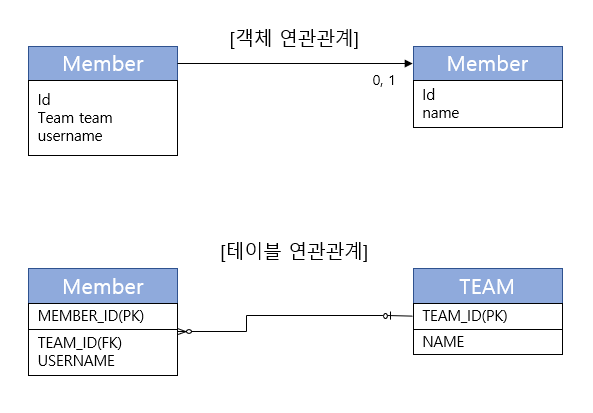

<h1><b>연관관계 기초 ♻</b></h1>

 
<a href="https://github.com/EungyuCho/orm_group_study/blob/master/README.md">목차로 돌아가기</a> 🏃 
<h3>5장에서는 JPA의 참조와 외래키를 어떻게 매핑하는지 알아보자.</h3>
엔티티는 대부분 다른 엔티티가 연관관계가 있다. 
객체는 참조(주소)를 사용해서 관계를 맺고 테이블을 외래 키를 사용해서 관계를 맺는다. 
서로 다른 두개를 매핑하는것이 이장의 목표이다. 
시작하기 전에 연관관계 매핑을 이해하기 위해 두가지 키워드를 정리해보자.
<ol>
    <li>방향(Direction): [단방향, 양방향]이 있다. 방향은 객체관계에만 존재하고 테이블 관계는 항상 양방향이다<blockquote>
    예를 들어 회원과 팀이 있을때 회원 -> 팀 또는 팀 -> 회원 둘 중 한쪽만 참조하는 것을 단반향 관계라 하고 회원 -> 팀, 팀 -> 회원 양쪽 모두 서로 참조하는 것을 양방향 관계라고 한다.</blockquote></li>
    <li>다중성(Multiplicity): [다대일(N:1), 일대다(1:N), 일대일(1:1), 다대다(N:M)] 다중성이 있다.<blockquote>
    예를 들어 회원과 팀 관계가 있을 때 여러 회원은 한 팀에 속하므로 회원과 팀은 다대일(N:1)관계이다. 반대로 한 팀에 여러회원이 소속될 수 있으므로 팀과 회원의 관계는 일대다(1:N) 관계이다.</blockquote></li>
    <li>연관관계의 주인(Owner) : 객체를 양방향 연관관계로 만들면 연관관계의 주인을 정해야한다.</li>
</ol>

<h3>1. 단방향 연관관계</h3>
연관관계 중에선 다대일(N:1) 단반향 관계를 가장 먼저 이해해야 한다. 지금부터 회원과 팀의 관계를 통해 다대일 단반향 고나계를 알아보자. 
 
<ul>
    <li>회원과 팀이 있다.</li>
    <li>회원은 하나의 팀에만 소속될 수 있다.</li>
    <li>회원과 팀은 다대일 관계다.</li>
</ul>

위 그림을 통해 단방향 연관관계를 알아보자. 
<h5>객체 연관관계</h5>
<ul>
    <li>회원과 객체는 Member.team 필드(멤버변수)로 팀 객체와 연관관계를 맺는다.</li>
    <li>회원 객체와 팀 객체는 단방향 관계이다. 회원은 Member.team 필드를 통해서 팀을 참조할 수 있지만 팀은 회원을 알 수 없다.</li>
</ul>
<h5>테이블 연관관계</h5>
<ul>
    <li>회원 테이블은 TEAM_ID 외래 키로 팀 테이블과 연관관계를 맺는다.</li>
    <li>회원 테이블과 팀 테이블은 양방향 관계이다. MEMBER테이블의 TEAM_ID 외래키로 MEMBER테이블과 TEAM테이블을 조인할 수 있다. 어느테이블을 기준으로 잡아도 JOIN이 가능하므로 양방향 관계이다.</li>
</ul>
위같이 객체는 참조로 연관관계를 맺고 테이블은 외래 키로 연관관계를 맺는다. 
이제 JPA를 사용해서 객체와 테이블의 연관관계를 매핑해 보자.
<pre><code>@Entity
public class Member    { 
    @Id
    @Column(name = "MEMBER_ID")
    private String id; 
    private String username; 
    //연관관계 매핑
    @ManyToOne
    @JoinColumn(name = "TEAM_ID")
    private Team team; 
    //연관관계 설정
    public void setTeam(Team team)
</code></pre>