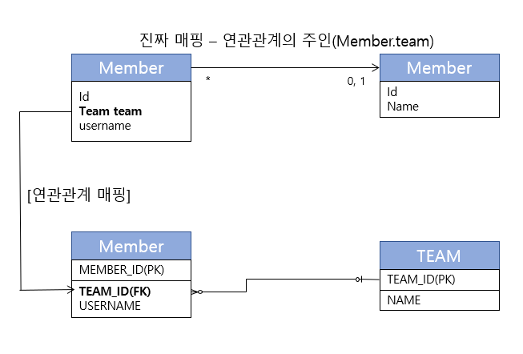
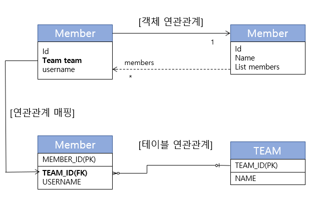
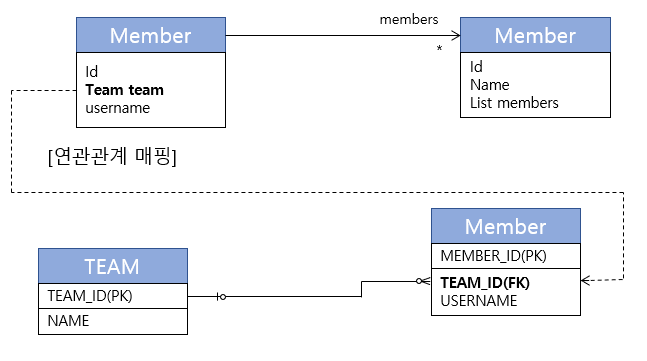
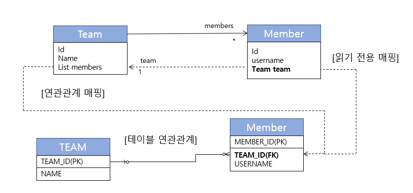
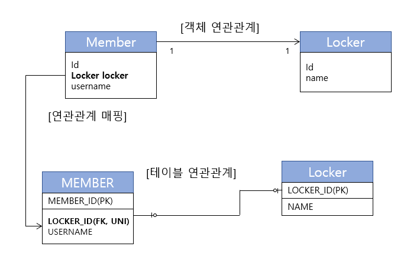
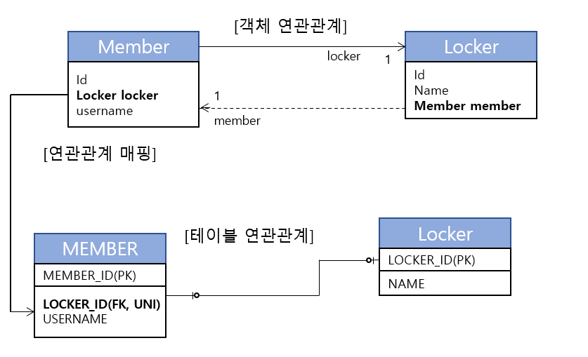
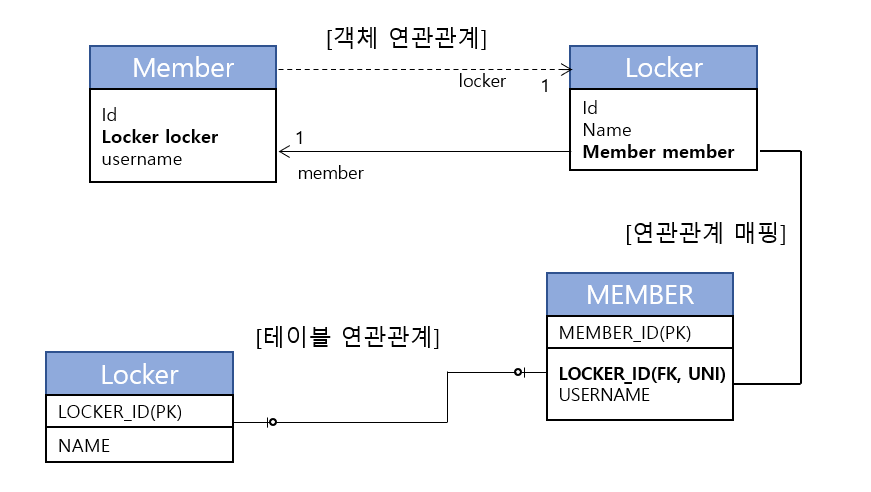

<h1><b>다양한 연관관계 매핑 🙉</b></h1>

 
<a href="https://github.com/EungyuCho/orm_group_study/blob/master/README.md">목차로 돌아가기</a> 🏃 
<h3>6장에서는 다양한 연관관계를 다룬다.</h3>
우선 들어가기 전에 내용을 한번 더 정리하고 들어가도록 하자. 
엔티티의 연관관계를 매핑할 때는 다음 3가지를 고려해야 한다.
<ul>
    <li>다중성</li>
    <li>단방향, 양방향</li>
    <li>연관관계의 주인</li>
</ul>
우선 두 엔티티가 일대일인지 일대다인지 다중성을 고려하고 다음으로 두엔티티가 한쪽만 참조하는 단방향인지 아니면 양방향으로 참조하는지 고려하고 그다음엔 양방향 관계일 시 외래키를 기준으로 연관관게의 주인을 설정해야한다. 
<h4>다중성</h4>
다중성에는 다음과 같은 다중성들이 있다
<ul>
    <li>다대일(<code>@ManyToOne</code>)</li>
    <li>일대다(<code>@OneToMany</code>)</li>
    <li>일대일(<code>@OneToOne</code>)</li>
    <li>다대다(<code>@ManyToMany</code>)</li>
</ul>
다중성이 판단하기 어려울 때에는 반대방향을 생각해보면 된다.
<h4>단방향, 양방향</h4>
테이블은 하나의 외래 키만 가지고도 두 테이블을 JOIN 할 수 있으니 사실 방향의 개념이 없지만 객체는 참조용 필드를 가지고 연관된 객체를 조회하므로 객체관게에서 한쪽만 참조하는것을 단방향 관계, 양방향을 참조하는것이 양방향 관계라 한다.
<h4>연관관계의 주인</h4>
데이터베이스는 외래 키 하나로 두 테이블이 연관관계를 맺는다. 하지만 객체는 서로 단방향 2개로 관계ㅖ를 맺으므로 포인트가 2곳이다. 
그래서 JPA는 두 객체 연관관계 중 하나를 정해서 데이터베이스 외래 키를 관리하도록 하는데 이것을 연관관계의 주인이라 한다. 
연관관계의 주인이 아닌 방향은 외래 키를 변경할 수 없고 읽기만 가능하다. 
연관관계의 주인은 <code>mappedBy</code> 속성을 사용하지 않는다. 주인이 아닐 시 <code>mappedBy</code> 속성을 사용해서 연관관계의 주인 필드 이름을 바라보게 한다.

<h3>다대일</h3>

<h4>다대일 단방향[N:1]</h4>

<pre><code>//회원 엔티티
@Entity
public class Member{ 
    @Id @GeneratedValue
    @Column (name = "MEMBER_ID")
    private Long id; 
    private String username; 
    @ManyToOne
    @JoinColumn (name = "TEAM_ID")
    private Team team; 
    //Getter, Setter ...
    ...
} 
//팀 엔티티
@Entity
public class Team  { 
    @Id @GeneratedValue
    @Column (name = "TEAM_ID")
    private Long id; 
    private String name; 
    //Getter, Setter ...
    ...
}</code></pre>
회원은 Member.team으로 팀 엔티티를 참조할 수 있지만 팀에서는 회원을 참조할 수 있는 필드가 없으므로 다대일 단방향 연관관계이다.
<code>@JoinColumn(name = "TEAM_ID")</code>를 사용해서 Member.team 필드를 테이블의 TEAM_ID(FK)와 매핑했다.
<h4>다대일 양방향[N:1, 1:N]</h4>
밑의 그림에서 실선이 연관관계의 주인(Member.team)이고, 점선(Team.members)는 연관관게의 주인이 아니다. 

<pre><code>//회원 엔티티
@Entity
public class Member{ 
    @Id @GeneratedValue
    @Column (name = "MEMBER_ID")
    private Long id; 
    private String username; 
    @ManyToOne
    @JoinColumn (name = "TEAM_ID")
    private Team team; 
    public void setTeam(Team team)  {
        this.team = team; 
        //기존 팀과 관계를 제거
        if(!team.getMembers().contains(this)){
            this.getMembers().add(this);
        }
    }
} 
//팀 엔티티
@Entity
public class Team  { 
    @Id @GeneratedValue
    @Column (name = "TEAM_ID")
    private Long id; 
    private String name; 
    @OneToMany(mappedby = "team")
    private List&#60;Member&#62 members = new ArrayList&#60;Member&#62(); 
    public void addMember (Member member)   {
        this.members.add(member);
        if(member.getTeam() != this)    {   //무한루프에 빠지지 않도록 체크
            member.setTeam(this);
        }
    }
    ...
}</code></pre>
<h5>양방향은 외래 키가 있는 쪽이 연관관계의 주인</h5>
일다대와 다대일은 항상 다(N)에 외래 키가 있다. 다쪽인 Member테이블에 외래 키를 가지고 있기 때문이다.
<h5>양방향 연관관계는 항상 서로를 참조해야 한다</h5>
양방향 연관계는 항상 서로 참조해야 한다. 위처럼 Entity에 편의 메소드를 만들어서 관리하면된다. 편의메소드를 한
편의메소드는 한쪽에만 작성하거나 양쪽에 다 작성할 수 있는데 양쪽에 작성 할 시 무한루프에 빠지므로 주의해야한다(무한루프 탈출 로직을 구현할 것)

<h3>일대다</h3>

일대다 관계는 다대일 관계의 반대 방향이다. 일대 다 관계는 엔티티를 하나 이상 참조할 수 있으므로 Collection, List, Set, Map 중에 하나를 사용하자.
<h4>일대다 단방향[1:N]</h4>
하나의 팀은 회원을 참조할 수 있는데 이런 관계를 일대다 관계라 한다. 그리고 팀은 회원들을 참조하지만 반대로 회원은 팀을 참조하지 않으면 둘의 관계는 단방향이다.

일대 다 단방향 관계는 특이하게 Team.members로 회원 테이블의 TEAM_ID 외래 키를 관리한다. 원래라면 Member테이블에 외래키를 지정하는게 맞겠지만, 현재 외래 키를 매핑할 수 있는 필드가 없으므로 반대편에서 관리하는 모습이 나타난다. 
이제 매핑한 팀과 회원 엔티티를 확인해보자.
<pre><code>//회원 엔티티
@Entity
public class Member{ 
    @Id @GeneratedValue
    @Column (name = "MEMBER_ID")
    private Long id; 
    private String username; 
    //Getter, Setter ...
} 
//팀 엔티티
@Entity
public class Team  { 
    @Id @GeneratedValue
    @Column (name = "TEAM_ID")
    private Long id; 
    private String name; 
    @OneToMany
    @JoinColumn(name = "TEAM_ID")   //MEMBER 테이블의 TEAM_ID(FK)
    private List&#60;Member&#62 members = new ArrayList&#60;Member&#62(); 
    //Getter Setter ...
}</code></pre>
단방향 관계를 매핑할 때는 @JoinColumn을 명시해야한다. 생략 할 시 JPA는 조인 테이블 전략을 기본으로 사용해서 매핑한다.(7장에서 알아보자)
<h5>일대다 단방향 매핑의 단점</h5>
일대다 단방향 매핑은 매핑한 객체가 관리하는 외래 키가 다른 테이블에 있다는 점이 단점이다. 
코드로 왜 불편한지 살펴보자.
<pre><code>public void testSave()  { 
  Member member1 = new Member("member1", 회원1");
  Member member2 = new Member("member1", 회원2"); 
    Team team1 = new Team("team1", "팀1");
    team1.getMembers().add(member1);
    team1.getMembers().add(member2); 
    em.persist(member1);    //INSERT-member1
    em.persist(member2);    //INSERT-member2
   member1.setTeam(team1);  //INSERT-team1, UPDATE=member1.fk, UPDATE-member2.fk 
   transaction.commit();
}</code></pre>
실행 결과 SQL은 다음과 같다.
<pre><code>insert into Member (MEMBER_ID, username) values (null, ?)
insert into Member (MEMBER_ID, username) values (null, ?)
insert into Team (TEAM_ID, username) values (null, ?)
update Member set TEAM_ID=? where MEMBER_ID=?
update Member set TEAM_ID=? where MEMBER_ID=?</code></pre>
Member 엔티티는 Team 엔티티를 모르므로 null로 INSERT 후에 TEAM.members의 참조 값을 확인해서 회원테이블에 TEAM_ID를 업데이트한다.
<h4>일대다 단방향 매핑보다 다대일 양방향 매핑을 사용하자</h4>
관리도 성능도 문제가있는 일대다 단방향보다는 다대일 양방향 매핑으로 관리하는게 좋다. 
다대일 양방향 매핑은 관리해야 하는 외래 키가 본인 테이블에 있으므로 단방향 매핑같은 문제가 발생하지 않는다.
이제 팀 엔티티, 회원엔티티 코드로 일대다 양방향 관계를 알아보자.

<pre><code>//회원 엔티티
@Entity
public class Member{ 
   @Id @GeneratedValue
   @Column (name = "MEMBER_ID")
   private Long id; 
   private String username; 
   @ManyToOne
   <b>@JoinColumn(name = "TEAM_ID", insertable = false, updatable = false)</b>
   private Team team; 
   //Getter, Setter ...
} 
//팀 엔티티
@Entity
public class Team  { 
   @Id @GeneratedValue
   @Column (name = "TEAM_ID")
   private Long id; 
   private String name; 
   @OneToMany
   @JoinColumn(name = "TEAM_ID")
   private List&#60;Member&#62 members = new ArrayList&#60;Member&#62(); 
   //Getter Setter ...
}</code></pre>
이번에는 <code>@JoinColumn(name = "TEAM_ID")</code>를 두 엔티티 모두에 추가했다. 
이 방법은 양방향처럼 보이도록 하는 방법으로 이 경우에는 대다일쪽(Member)에 <code>insertable = false, updatable = false</code>로 읽기만 사용 가능하도록 설정해주자.

<h3>일대일</h3>

일대일 관계는 양쪽이 서로 하나의 관계만 가지는데 예를 들어 사물함과 학생이 있다. 
사물함은 학생 한명이 사용하므로(공유하지않음) 일대일 관계이다. 
일대일 관계는 다음과 같은 특징이 있다.
<ul>
    <li>일대일 관계는 그 반대도 일대일 관게다</li>
    <li>테이블 관계에서 일대다, 다대일은 항상 다(N)쪽이 외래 키를 가지지만 일대일은 주 테이블이나 대상 테이블 어느곳이던 상관없다.</li>
</ul>
관계를 하나씩 살펴보자
<h4>주 테이블에 외래 키</h4>
일대일 관계를 구성할 때 객체지향 개발자들은 주 테이블에 외래 키를 선호한다. JPA도 주 테이블에 외래 키가 있으면 좀 더 편리하게 매핑할 수 있다 
우선 단방향 관계를 살펴보고 양방향을 보도록 하자. 
<b>단방향</b>

<pre><code>@Entity
public class Member    { 
    @Id @GeneratedValue
    @Column(name = "MEMBER_ID")
    private Long id; 
    private String username; 
    @OneToOne
    @JoinColumn(name = "LOCKER_ID")
    private Locker locker;
    ...
} 
@Entity
public class Locker    { 
    @Id @GeneratedValue
    @Column(name = "LOCKER_ID")
    private Long id; 
    private String name;
    ...
}</code></pre>
일대일 관계이므로 객체 매핑에 <code>@OneToOne</code>을 사용했고 데이터베이스에는 LOCKER_ID 외래 키에 유니크 제약조건(UNI)을 추가했다. 
다음으로 반대방향을 추가해서 일대일 양방향 관계로 만들어보자.

<pre><code>@Entity
public class Member    { 
    @Id @GeneratedValue
    @Column(name = "MEMBER_ID")
    private Long id; 
    private String username; 
    @OneToOne
    @JoinColumn(name = "LOCKER_ID")
    private Locker locker;
    ...
} 
@Entity
public class Locker    { 
    @Id @GeneratedValue
    @Column(name = "LOCKER_ID")
    private Long id; 
    private String name; 
    @OneToOne(mappedBy = "locker")
    private Member member;
    ...
}</code></pre>
양방향이므로 연관관계의 주인을 정해야한다. MEMBER 테이블이 외래키를 가지고 있으므로 Member.locker가 연관관계의 주인이다. 따라서 반대매핑인 사물함의 Locker.member은 mappedBy로 locker필드를 바라보게 해준다. 
<h4>대상 테이블에 외래 키</h4>
이번에는 대상 테이블에 외래 키가 있는 일대일 관계를 알아보자 
우선 일대일 관계 중 대상 테이블에 외래 키가 있는 단방향 고나계는 JPA에서 지원하지 않으므로 양방향 관계를 알아보자.

<pre><code>@Entity
public class Member    { 
    @Id @GeneratedValue
    @Column(name = "MEMBER_ID")
    private Long id; 
    private String username; 
    @OneToOne
    @JoinColumn(name = "member")
    private Locker locker;
    ...
} 
@Entity
public class Locker    { 
    @Id @GeneratedValue
    @Column(name = "LOCKER_ID")
    private Long id; 
    private String name; 
    @OneToOne(mappedBy = "MEMBER_ID")
    private Member member;
    ...
}</code></pre>
일대일 매핑에서 대상 테이블에 외래 키를 두고 싶으면 이렇게 양방향으로 매핑하면 된다. 주 엔티티인 Member 대신에 대상 엔티티인 Locker를 연관관계의 주인으로 만들어서 LOCKER 테이블의 외래 키로 관리하도록 했다.

<h3>다대다 [N:N]</h3>

관계형 데이터베이스는 정규화된 테이블 2개로 다대다 관계를 표현할 수 없다. 그래서 보통 다대다 관계를 일대다, 다대일 관계로 풀어내는 연결 테이블을 사용하는데 
Member와 Product 엔티티가 있다고 치면 두 테이블을 바로 다대다 관계로 표현할 수는 없다. 
그래서 중간에 Member와 Product테이블을 연결해주는 테이블을 만들어준다(Member_Product). 
이 테이블로 일대다, 다대일 관계를 풀어내어서 다대다 관계를 매핑 할 수 있게 된다. 
JPA의 <code>@ManyToMany</code> 어노테이션을 통해서 다대다 매핑을 시작해보자.
<h4>다대다: 단방향</h4>
다대다 단방향인 회원과 상품 엔티티를 보자.
<pre><code>//회원
@Entity
public class Member    { 
    @Id @Column(name = "MEMBER")
    private String id; 
    private String username; 
    @ManyToMany
    @JoinTable(name = "MEMBER_PRODUCT",
        joinColumns = @JoinColumn(name = "MEMBER_ID"),
        inverseJoinColumns = @JoinColumn(name = "PRODUCT_ID")) 
    private List&#60;Product&#62 products = new ArrayList&#60;Product&#62();
    ...
} 
//단방향 상품
@Entity
public class Product   { 
    @Id @Column(name = "PRODUCT_ID")
    private String id; 
    private String name;
    ...
}</code></pre>
회원 엔티티와 상품 엔티티를 <code>@ManyToMany</code>로 매핑했다. 여기서 중요한건 <code>@ManyToMany</code>와 <code>@JoinTable</code>을 사용해서 연결 테이블을 바로 매핑한 것이다. 
회원과 상품을 연결하는 회원_상품(Member_Product) 엔티티 없이 매핑을 완료할 수 있다. 
연결 테이블을 매핑하는 <code>@JoinTAble</code>의 속성을 정리해보자.
<ul>
    <li><code>@JoinTable.name</code>: 연결 테이블을 지정한다. 현재 예제에서는 MEMBER_PRODUCT 테이블을 선택했다.</li>
    <li><code>@JoinTable.joinColumns</code>: 현재 방향인 회원과 매핑할 조인 컬럼 정보를 지정한다. MEMBER_ID로 지정했다.</li>
    <li><code>@JoinTable.inverseJoinColumns</code>: 반대 방향인 상품과 매핑할 조인 컬럼 정보를 지정한다. PRODUCT_ID로 지정했다.</li>
</ul> 
MEMBER_PRODUCT 테이블은 다대다 관계를 일대다, 다대일 관계로 필요한 연결 테이블일 뿐이다. <code>@ManyToMany</code>로 매핑해두면 이 테이블을 신경쓰지않아도 된다. 이제 저장하는 예제를 살펴보자 
<pre><code>public void save()   { 
    Product productA = new Product();
    productA.setId("productA");
    productA.setName("상품A");
    em.persist(productA); 
    Member member1 = new Member();
    member1.setId("member1");
    member1.setUsername("회원1");
    member1.getProducts().add(productA);    //연관관계 생성
    em.persist(member1);
}</code></pre>
회원1과 상품A의 연관관계를 설정했으므로 회원1을 저장할 때 연결테이블에도 값이 저장된다. 그러므로 아래의 SQL이 실행된다.
<pre><code>INSERT INTO PRODUCT ...
INSERT INTO MEMBER ...
INSERT INTO MEMBER_PRODUCT ...</code></pre>
이제 저장한 Product를 조회해보자.
<pre><code>public void find()   {
    Member member = em.find(Member.class, "member1");
    List&#60;Product&#62 products = member.getProducts();   //객체 그래프 탐색
    for (Product product : products)    {
        System.out.println("product.name = " = product.getName());
    }
}</code></pre>
<code>member.getProduct</code> 메소드를 호출하고 상품 이름을 출력하면 다음 SQL이 실행된다.
<pre><code>SELECT * FROM MEMBER_PRODUCT MP
INNER JOIN PRODUCT P ON MP.PRODUCT_ID=P.PRODUCT_ID
WHERE MP.PRODUCT=?</code></pre>
실행된 SQL을 보면 연결 테이블인 MEMBER_PRODucT와 상품 테이블을 조인해서 연관된 상품을 조회한다. 
<code>@ManyToMany</code> 덕분에 다대다 관계를 어플리케이션에서는 단순하게 사용할 수 있다.
<h4>다대다: 양방향</h4>
다대다 매핑이므로 역방향도 <code>@ManyToMany</code>를 설정해준다. 그리고 양쪽 중 원하는 곳에 <code>mappedBy</code>로 연관관계의 주인을 지정한다.(물론 <code>mappedBy</code>가 없는 곳이 연관관계의 주인이다.) 
<pre><code>@Entity
public class Product   { 
    @Id
    private String id; 
    @ManyToMany (mappedBy = "products") //역방향 추가
    private List&#60;Member&#62 members;
    ...
}</code></pre>
다대다의 양방향 연관관계는 다음처럼 설정하면 된다.
<pre><code>member.getProducts().add(product);
product.getMembers().add(member);</code></pre>
편의 메소드로 리팩토링하면
<pre><code>public void addProduct(Product product)  {
    ...
    products.add(product);
    product.getMembers().add(this);
}</code></pre>
연관관계 편의 메소드를 추가했으므로 다음처럼 양방향 연관관계를 설정하면 된다. 
<code>member.addProduct(product);</code> 
양방향으로 연관관계가 설정되었으므로 <code>product.getMembers()</code>를 사용해서 역방향으로 객체 그래프를 탐색할 수 있다.
 
양방향 연관관게를 만들었으므로 <code>product.getmembers()</code>를 사용해서 역방향으로 객체 그래프를 탐색할 수 있다.
<pre><code>public void findInverse()   { 
    Product product = em.find(Product.class, "productA");
    List&#60;Member&#62 members = product.getmembers();
    for (Member member : members)   {
        System.out.println("member = " + member.getUsername());
    )
}</code></pre>
위 코드처럼 역방향 탐색을 할 수 있다.
<h4>다대다: 매핑의 한계와 극복, 연결 엔티티 사용</h4>
<code>@ManyToMany</code>를 사용하면 연결 테이블을 자동으로 처리해주므로 도메인 모델이 단순해지고 여러 가지로 편리하다. 하지만 지금 상태에서는 언제 주문을 했는지, 주문 수량은 얼마인지 알 수 없다. 
Member와 Product 사이의 테이블 MemberProduct에 주문수량과 주문 날짜 컬럼을 추가해 보자.
[그림 업데이트 예정-p226]
위와 같이 엔티티를 설정할 것이다 아래 코드를 보자.
<pre><code>//회원 코드
@Entity
public class Member{ 
    @Id
    @Column (name = "MEMBER_ID")
    private Long id; 
    @OneToMany(mappedBy = "member")
    private List&#60;MemberProducts&#62 memberproducts; 
    ...
} 
//상품 코드
@Entity
public class Product  { 
    @Id
    @Column (name = "PRODUCT_ID")
    private String id; 
    private String name; 
    ...
} 
//회원 상품 엔티티 코드
@Entity
@IdClass(MemberProductId.class)
public class MemberProduct  { 
    @Id
    @ManyToOne
    @JoinColumn(name = "MEMBER_ID")
    private Member member;  //MemberProductId.member 와 연결 
    @Id
    @ManyToOne
    @JoinColumn(name = "PRODUCT_ID")
    private Product product;    //MemberProductId.product와 연결 
    private int orderAmount; 
    ...
}
//회원상품 식별자 클래스
public class MemberProductId implements Serializable   { 
    private String member;  //MemberProduct.member와 연결
    private String product; //MemberProduct.product와 연결 
    //hashCode and equals 
    @Override
    public boolean equals(Object o) {...} 
    @Override
    public int hashCode()   {...}
}</code></pre>
위와 같이 MemberProduct 클래스에서 복합키로 매핑하기 위해 우선 기본 키를 매핑하는 <code>@Id</code>와 <code>@JoinColumn</code>을 동시에 사용해서 기본 키 + 외래 키를 한번에 매핑했다. 
<code>@IdClass</code> 어노테이션을 사용해서 복합 기본 키를 매핑하고  식별자 클래ㅔ스를 정의했다. JPA에서 복합 기본 키를 사용하려면 식별자 클래스를 위와같이 만들어야하는데 아래 조건들이 있다.
<ul>
    <li>복합 키는 별도의 식별자 클래스로 만들어야 한다.</li>
    <li><code>Serializable</code>을 구현해야 한다.</li>
    <li><code>equals</code>와 <code>hashCode</code> 메소드를 구현해야 한다.</li>
    <li>기본 생성자가 있어야 한다</li>
    <li>식별자 클래스는 <code>public</code>이어야 한다.</li>
    <li><code>@IdClass</code>를 사용하는 방법 외에 <code>@EmbeddedId</code>를 사용하는 방법도 있다.</li>
    
</ul>
MemberProduct는 회원과 상품의 기본 키를 받아서 자신의 기본키로 사용하는데 이렇게 부모 테이블의 기본 키를 받아서 자신의 기본 키 + 외래 키로 사용하는 것을 데이터베이스에서는 식별 관계라 한다. 
이렇게 구현한 관계를 어떻게 저장하는지 살펴보자
<pre><code>public void save()  { 
    //회원 저장
    Member member1 = new Member();
    member1.setId("member1");
    member1.setUsername("회원1");
    em.persist(member1); 
    //상품 저장
    Product productA = new Product();
    productA.setId("productA");
    productA.setName("상품1");
    em.persist(productA); 
    //회원상품 저장
    MemberProduct memberProduct = new MemberProduct();
    memberProduct.setMember(member1);   //주문 회원 - 연관관계 설정
    memberProduct.setProduct(product1); //주문 상품 - 연관관계 설정
    memberProduct.setOrderAmount(2);    //주문 수량 
    em.persist(memberProduct);
}</code></pre>
위처럼 회원 상품엔티티를 만들면서 연관된 회원, 상품 엔티티를 설정하면 데이터베이스에 저장할 때 각각의 식별자를 가져와서 자신의 기본 키 값으로 사용한다. 
다음으로는 조회하는 코드를 살펴보자.
<pre><code>public void find()   { 
    //기본 키 값 생성
    MemberProductId.memberProductId = new MemberProductId();
    MemberProductId.setMember("member1");
    MemberProductId.setProduct("productA"); 
    MemberProduct memberProduct = em.find(MemberProduct.class, memberProductId); 
    Member member = memberProduct.getMember();
    Product product = memberProduct.getProduct(); 
    System.out.println("member = " + member.getUsername());
    System.out.println("product = " + product.getName());
    System.out.println("orderAmount = " + 
        memberProduct.getOrderAmount()); 
}</code></pre>
복합키를 사용하면 이제 항상 식별자 클래스를 만들어야 한다. 식별자 클래스를 <code>em.find()</code>로 식별자를 조회해서 연관 엔티티를 생성한다. 
복합키를 사용하려면 ORM 매핑에서 처리해야 할 일이 많아지므로 복합 키를 사용하지 않고 다대다 관계를 구성하는 방법도 알아보자. 
<h4>다대다: 새로운 기본키 사용</h4>
추천하는 기본 키 생성 전략은 데이터베이스에서 자동으로 생성해주는 대리 키를 Long 값으로 사용하는 것이다. 
이렇게 하면 거의 영구히 쓸 수 있으며 비즈니스 로직에 의존하지 않는다. 또한 ORM 매핑 시 복합 키를 만들지 않아도 된다. 
[그림 - 업데이트 예정(p231)] 
위의 그림을 보면 ORDER_ID라는 새로운 기본 키를 하나 만들고 이전에 복합 키로 사용했던 MEMBER_ID, PRODUCT_ID 컬럼은 외래 키로만 사용한다. 
구현 코드를 보자.
<pre><code>@Entity
public class Order { 
    @Id @GeneratedValue
    @Column(name = "ORDER_ID")
    private Long id; 
    @ManyToOne
    @JoinColumn(name = "MEMBER_ID")
    private Member member; 
    @ManyToOne
    @JoinColumn(name = "PRODUCT_ID")
    private Product product; 
    private int orderAmount;
    ...
}</code></pre>
대리키를 사용함으로써 식별자클래스를 정의할 필요가 없어졌고 이해도 하기가 쉬워졌다. 저장하고 조회하는 코드를 확인해보자.
<pre><code>//저장
public void save()  { 
   //회원 저장
   Member member1 = new Member();
   member1.setId("member1");
   member1.setUsername("회원1");
   em.persist(member1); 
   //상품 저장
   Product productA = new Product();
   productA.setId("productA");
   productA.setName("상품1");
   em.persist(productA); 
   //회원상품 저장
   Order order = new Order();
   order.setMember(member1);   //주문 회원 - 연관관계 설정
   order.setProduct(product1); //주문 상품 - 연관관계 설정
   order.setOrderAmount(2);    //주문 수량 
   em.persist(order);
} 
//조회 
public void find()   { 
    //기본 키 값 생성
    Long orderId = 1L;
    Order order = em.find(Order.class, orderId); 
    Member member = order.getMember();
    Product product = order.getProduct(); 
    System.out.println("member = " + member.getUsername());
    System.out.println("product = " + product.getName());
    System.out.println("orderAmount = " + 
        order.getOrderAmount()); 
}</code></pre>
코드가 식별자 클래스를 사용할 때보다 훨씬 단순해진걸 알 수 있다. 
<h4>다대다 연관관계 정리</h4>
다대다 관계를 일대다 다대일 관계로 풀어내기위해 연결 테이블을 만들 때 식별자를 어떻게 구성할지 선택해야 한다. 
<ul>
    <li>식별 관계: 받아온 식별자를 기본 키 + 외래 키로 사용한다.</li>
    <li>비식별 관계: 받아온 식별자는 외래 키로만 사용하고 새로운 식별자를 추가한다.</li>
</ul>
데이터베이스 설계에서는 1번처럼 부모 테이블의 기본 키를 받아서 자식 테이블의 기본 키 + 외래 키로 사용하는 것을 식별 관계라 하고, 2번처럼 단순히 외래 키로만 사용하는 것을 비식별 관계라 한다. 
객체 입장에서 보면 2번처럼 비식별 관계를 사용하는 것이 편리하게 ORM 매핑을 할 수 있다. 이유는 7-3절에서 알아보자.